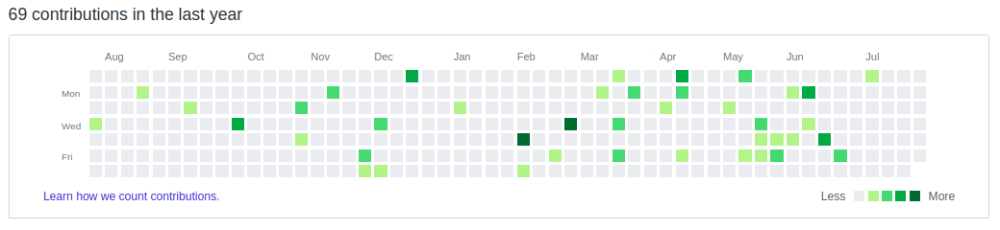
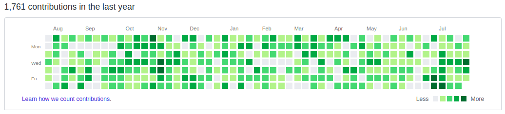

# ContribX - GitHub Contribution Graph Generator


[](https://github.com/aaditya09750/AG-ActivityGen/actions?query=workflow%3Abuild)

ContribX is a command-line utility that programmatically generates backdated Git commits to populate a GitHub Contributions Graph. The tool creates authentic commit objects with configurable date ranges, frequency distributions, and volume controls, producing a realistic contribution history across any specified time window.

**Author:** [Aaditya Gunjal](https://github.com/aaditya09750)

---

## Disclaimer

This tool is developed strictly for **educational purposes** and for demonstrating the internal mechanics of Git commit history and the GitHub Contributions Graph rendering system. It is not intended to misrepresent professional development activity, fabricate employment credentials, or inflate contribution metrics for any professional or commercial purpose. Use responsibly and ethically.

---

## Visual Demonstration

### Before



### After



The screenshots above illustrate the transformation of a GitHub profile's contribution graph after a single execution of the ContribX script with default parameters (365 days, 80% frequency, up to 10 commits per day).

---

## Core Features

- **Automated Contribution Generation:** Produces up to a full year of realistic, backdated Git commits in a single script execution, eliminating any manual commit workflow.
- **Configurable Commit Frequency:** Fine-grained control over what percentage of days within the target window receive commits. The default is 80%, but values from 0 to 100 are accepted, allowing sparse or dense contribution patterns.
- **Adjustable Daily Commit Volume:** The maximum number of commits per day is configurable (1 to 20). The actual count for each day is randomly selected between 1 and the configured maximum, producing organic variation in the graph.
- **Weekend Exclusion:** An optional flag (`--no_weekends`) suppresses all commit generation on Saturdays and Sundays, producing a weekday-only contribution pattern consistent with professional development workflows.
- **Flexible Date Range Control:** The `--days_before` and `--days_after` parameters allow precise control over the start and end boundaries of the commit window relative to the current date, enabling targeted graph population for specific time periods.
- **Specific Date Targeting:** New `--specific-dates` parameter enables precise targeting of exact dates for commit generation. Accepts comma-separated dates in customizable formats (e.g., "2026-09-13,2026-09-14" or "09/13/2026,09/14/2026"). When specified, date range parameters are ignored, allowing surgical precision over contribution timing.
- **Conventional Commits Support:** New `--conventional-commits` flag generates commits following the conventional commits specification (e.g., "feat: contribution on YYYY-MM-DD HH:MM"). Ideal for professional repositories that enforce commit message standards.
- **Existing Repository Support:** The `--path` parameter allows ContribX to operate within an already-initialized local Git repository, finding the nearest parent `.git` root automatically. This enables incremental contribution additions without creating a new repository.
- **Automatic Remote Push:** When a `--repository` URL is provided (SSH or HTTPS format), the script automatically configures the remote origin, renames the branch to `main`, and pushes all generated commits in a single operation.
- **Per-Run Git Identity Overrides:** The `--user_name` and `--user_email` parameters override the local Git configuration for the current execution only, without modifying the global Git settings. This ensures the generated commits are attributed to the correct GitHub account.
- **Continuous Integration:** A GitHub Actions workflow validates code quality (flake8 linting) and functional correctness (unittest) across Python versions 3.8, 3.9, 3.10, and 3.11 on every push and pull request.

---

## New Features (v2.0)

This release introduces powerful new capabilities for targeted contribution generation and professional commit formatting:

### Specific Date Targeting (`--specific-dates`)

Generate commits on **exact dates only**, bypassing the random date range logic. Perfect for:
- Backfilling specific dates in your contribution graph
- Creating targeted contribution patterns
- Professional contribution records with precise control

**Example:** Generate commits only on September 13th and 14th:
```bash
python ag-activity-gen-main/contribute.py --path=./AG-Activity --specific-dates="2026-09-13,2026-09-14" --max_commits=5
```

**Supported Date Formats:**
- Default: `YYYY-MM-DD` (e.g., `2026-09-13`)
- Custom formats via `--date-format`, e.g., `%m/%d/%Y` for `09/13/2026`
- Comma-separated dates: `2026-09-13,2026-09-14,2026-09-15`

When using `--specific-dates`:
- `--days_before`, `--days_after`, and `--frequency` are **ignored**
- `--max_commits` and `--no_weekends` are still **respected**
- Dates are automatically sorted and deduplicated

### Conventional Commits Support (`--conventional-commits`)

Generate commits following the **Conventional Commits** specification for professional development workflows:

- **Default format:** `Contribution: YYYY-MM-DD HH:MM`
- **Conventional format:** `feat: contribution on YYYY-MM-DD HH:MM`

The conventional format is ideal for:
- Professional repositories with commit message linting (commitlint, husky)
- Teams using semantic versioning and automated changelog generation
- CI/CD pipelines that parse commit messages for release automation

**Example:** Generate conventional commits on specific dates:
```bash
python ag-activity-gen-main/contribute.py --path=./AG-Activity --specific-dates="2026-09-13,2026-09-14" --conventional-commits
```

---

## Technology Stack

| Technology | Version | Purpose |
| ---------- | ------- | ------- |
| Python | 3.8+ | Primary script runtime and execution environment |
| Git | 2.x | Underlying version control system for commit generation and repository management |
| argparse | stdlib | Command-line interface argument parsing and validation |
| subprocess | stdlib | System-level Git command execution and process management |
| random | stdlib | Pseudorandom number generation for daily commit count variation |
| datetime | stdlib | Date arithmetic, timestamp formatting, and commit date backdating |
| os | stdlib | Filesystem navigation, directory creation, and path resolution |
| flake8 | latest | Static code analysis and PEP 8 compliance enforcement (CI pipeline) |
| unittest | stdlib | Unit testing framework for argument parsing and commit generation validation |
| GitHub Actions | — | Continuous integration and automated testing pipeline |

---

## Project Structure

```text
ContribX/
|
+-- ag-activity-gen-main/                  [Source Code Directory]
|   +-- .github/
|   |   +-- workflows/
|   |   |   +-- build.yml                 CI workflow: lint + test across Python 3.8-3.11
|   |   +-- before.png                    Contribution graph screenshot (before execution)
|   |   +-- after.png                     Contribution graph screenshot (after execution)
|   +-- contribute.py                     Core script: commit generation engine with CLI interface
|   +-- test_contribute.py                Unit tests: argument parsing, commit count, and integration
|   +-- LICENSE                           Apache License 2.0
|
+-- AG-Activity/                           [Commit Target Directory]
|   +-- README.md                         Target file for generated commit entries (see AG-Activity docs)
|
+-- .git/                                  Git repository metadata
+-- README.md                              Project documentation (this file)
```

---

## Quick Start

### Prerequisites

| Requirement | Minimum Version | Installation |
| ----------- | --------------- | ------------ |
| Python | 3.8 or higher | [python.org/downloads](https://www.python.org/downloads/) |
| Git | 2.x or higher | [git-scm.com/downloads](https://git-scm.com/downloads) |
| GitHub Account | — | SSH or HTTPS authentication configured |

### Step 1 — Clone This Repository

Clone the ContribX tool to your local machine:

```bash
git clone https://github.com/aaditya09750/AG-ActivityGen.git
cd AG-ActivityGen
```

> **Important:** Do not fork this repository. GitHub does not count contributions made to forked repositories on your Contributions Graph. Instead, follow Steps 2 and 3 below to generate commits into your own repository.

### Step 2 — Create Your Own Repository on GitHub

1. Go to [github.com/new](https://github.com/new) and create a **new, empty repository** on your GitHub account.
2. Do **not** initialize it with a README, .gitignore, or license — the repository must be completely empty.
3. Note the repository URL. It will be in one of these formats:
   - SSH: `git@github.com:<your-username>/<your-repo>.git`
   - HTTPS: `https://github.com/<your-username>/<your-repo>.git`

Replace `<your-username>` with your GitHub username and `<your-repo>` with your new repository name throughout all commands below.

### Step 3 — Run the Script

**Automatic mode (generates commits and pushes to your repository):**

```bash
python ag-activity-gen-main/contribute.py --repository=git@github.com:<your-username>/<your-repo>.git
```

This creates a new local directory, generates up to a year of backdated commits, and pushes them to your empty repository in a single operation.

**Local mode (generates commits without pushing):**

```bash
python ag-activity-gen-main/contribute.py
```

After local generation, add your remote and push manually:

```bash
git remote add origin git@github.com:<your-username>/<your-repo>.git
git branch -M main
git push -u origin main
```

### Step 4 — Verify

1. Allow 2 to 5 minutes for GitHub to reindex contribution activity.
2. Navigate to your GitHub profile and inspect the Contributions Graph.
3. If the repository is private, confirm that private contribution visibility is enabled in your [GitHub profile settings](https://help.github.com/en/articles/publicizing-or-hiding-your-private-contributions-on-your-profile).

> **Important:** GitHub attributes contributions based on the email address associated with each commit. Ensure your local Git email matches the email registered on your GitHub account. If they differ, use the `--user_email` flag (see CLI Reference below).

---

## How It Works

ContribX operates through the following execution pipeline:

1. **Repository Initialization:** If no `--path` is provided, the script creates a new directory and initializes an empty Git repository with `git init -b main`. If `--path` is provided, it traverses upward from the specified directory to locate the nearest `.git` root.

2. **Commit Generation Loop:** The script supports two modes:
   - **Range Mode (default):** For each day in the configured date range (default: 365 days before the current date), the script evaluates two conditions: the day passes the frequency probability check (default: 80% chance), and if `--no_weekends` is enabled, the day is a weekday (Monday through Friday).
   - **Specific Dates Mode:** When `--specific-dates` is provided, the script iterates through only the specified dates, ignoring frequency and date range parameters, while still respecting `--no_weekends` and `--max_commits` settings.

3. **File Modification:** For each qualifying day, a random number of commits (between 1 and `--max_commits`) are generated. Each commit appends a timestamped line to the target `README.md` file. The commit message format depends on the selected mode:\n   - **Legacy Format (default):** `Contribution: YYYY-MM-DD HH:MM`\n   - **Conventional Format:** `feat: contribution on YYYY-MM-DD HH:MM` (when `--conventional-commits` is enabled)

4. **Backdated Commit Creation:** Each modification is staged with `git add .` and committed with `git commit --date`, setting the commit timestamp to the target day. This causes GitHub to render the commit on the corresponding day in the Contributions Graph.

5. **Remote Push:** If a `--repository` URL is provided, the script configures the remote origin (or updates it if one already exists), renames the branch to `main`, and executes a force push to the remote.

---

## Command-Line Interface Reference

### Complete Argument Table

| Short | Long Form | Type | Default | Description |
| ----- | --------- | ---- | ------- | ----------- |
| `-mc` | `--max_commits` | int | 10 | Maximum number of commits generated per qualifying day. The actual count is randomly selected between 1 and this value for each day, producing natural variation. Values exceeding 20 are clamped to 20; values below 1 are clamped to 1. |
| `-fr` | `--frequency` | int | 80 | Percentage probability (0–100) that any given day in the range will receive commits. A value of 60 means approximately 60% of days will have commits, with the remaining 40% left empty. |
| `-nw` | `--no_weekends` | flag | false | When set, no commits are generated on Saturdays or Sundays, regardless of the frequency setting. |
| `-db` | `--days_before` | int | 365 | Number of days before the current date to begin generating commits. A value of 30 starts the commit window 30 days in the past. Must be a non-negative integer. |
| `-da` | `--days_after` | int | 0 | Number of days after the current date to continue generating commits. A value of 15 extends the commit window 15 days into the future. Must be a non-negative integer. |
| `-r` | `--repository` | str | none | Remote repository URL in SSH (`git@github.com:user/repo.git`) or HTTPS (`https://github.com/user/repo.git`) format. When provided, the script automatically pushes all generated commits to this remote. |
| `-p` | `--path` | str | none | Absolute or relative path to a directory inside an existing Git repository. The script will locate the nearest parent `.git` root and use it as the working repository. The specified directory must exist and must be within an initialized Git repository. |
| `-un` | `--user_name` | str | git config | Overrides the `user.name` Git configuration for this execution only. Useful when the global Git identity differs from the GitHub account that should receive the contribution credit. |
| `-ue` | `--user_email` | str | git config | Overrides the `user.email` Git configuration for this execution only. This email must match the email address registered on the target GitHub account for contributions to be counted. |
| `-sd` | `--specific-dates` | str | none | Comma-separated list of specific dates to generate commits on. When specified, `--days_before`, `--days_after`, and `--frequency` are ignored. Supports custom date formats via `--date-format`. Example: `2026-09-13,2026-09-14` or `09/13/2026,09/14/2026`. The `--max_commits` and `--no_weekends` parameters are still respected. |
| `-df` | `--date-format` | str | %Y-%m-%d | Date format string for parsing dates in `--specific-dates`. Default is YYYY-MM-DD. Other examples: `%m/%d/%Y` for MM/DD/YYYY or `%d-%m-%Y` for DD-MM-YYYY. Follows Python's strftime format. |
| `-cc` | `--conventional-commits` | flag | false | When set, commits are generated using conventional commits format (e.g., "feat: contribution on YYYY-MM-DD HH:MM") instead of the default legacy format. Ideal for professional repositories following commit conventions. |

### Usage Scenarios

The following examples cover every common use case. All commands assume you have cloned this repository (Step 1) and created your own empty repository on GitHub (Step 2). Replace `<your-username>` with your GitHub username and `<your-repo>` with the name of your new empty repository in all commands below.

**Scenario 1 — Today only (single-day test run, local only)**

Generates commits for the current day only. No historical commits, no push. Ideal for verifying the setup before a full run.

```bash
python ag-activity-gen-main/contribute.py --path=./AG-Activity --days_before=0 --days_after=1 --frequency=100 --max_commits=3
```

**Scenario 2 — Today only with auto-push**

Same as above, but pushes the generated commits to the remote repository immediately after generation.

```bash
python ag-activity-gen-main/contribute.py --path=./AG-Activity --days_before=0 --days_after=1 --frequency=100 --max_commits=3 --repository=git@github.com:<your-username>/<your-repo>.git
```

**Scenario 3 — Last 7 days (one-week backfill)**

Populates the contribution graph for the past week. Useful for quick visual verification on a GitHub profile.

```bash
python ag-activity-gen-main/contribute.py --path=./AG-Activity --days_before=7 --days_after=0 --repository=git@github.com:<your-username>/<your-repo>.git
```

**Scenario 4 — Last 30 days (one-month backfill)**

Fills the most recent month on the contribution graph with moderate density.

```bash
python ag-activity-gen-main/contribute.py --path=./AG-Activity --days_before=30 --days_after=0 --frequency=70 --max_commits=8 --repository=git@github.com:<your-username>/<your-repo>.git
```

**Scenario 5 — Last 90 days (quarterly backfill)**

Covers the last three months. Reduces frequency slightly for a more organic pattern.

```bash
python ag-activity-gen-main/contribute.py --path=./AG-Activity --days_before=90 --days_after=0 --frequency=65 --max_commits=6 --repository=git@github.com:<your-username>/<your-repo>.git
```

**Scenario 6 — Full year (default parameters)**

Standard execution with all defaults: 365 days, 80% frequency, up to 10 commits per day. This is the most common use case.

```bash
python ag-activity-gen-main/contribute.py --path=./AG-Activity --repository=git@github.com:<your-username>/<your-repo>.git
```

**Scenario 7 — Full year with maximum density**

Generates commits on 100% of days with up to 20 commits each. Produces the densest possible contribution graph.

```bash
python ag-activity-gen-main/contribute.py --path=./AG-Activity --days_before=365 --days_after=0 --frequency=100 --max_commits=20 --repository=git@github.com:<your-username>/<your-repo>.git
```

**Scenario 8 — Full year with sparse, realistic pattern**

Lower frequency and fewer daily commits produce a natural-looking contribution history consistent with part-time or open-source development patterns.

```bash
python ag-activity-gen-main/contribute.py --path=./AG-Activity --days_before=365 --days_after=0 --frequency=40 --max_commits=4 --repository=git@github.com:<your-username>/<your-repo>.git
```

**Scenario 9 — Weekdays only (professional pattern)**

Skips all Saturdays and Sundays. Produces a contribution graph that reflects a standard Monday-through-Friday development schedule.

```bash
python ag-activity-gen-main/contribute.py --path=./AG-Activity --no_weekends --repository=git@github.com:<your-username>/<your-repo>.git
```

**Scenario 10 — Weekdays only with reduced volume**

Combines weekend exclusion with lower frequency and commit count for a conservative, professional-looking graph.

```bash
python ag-activity-gen-main/contribute.py --path=./AG-Activity --no_weekends --frequency=50 --max_commits=4 --repository=git@github.com:<your-username>/<your-repo>.git
```

**Scenario 11 — Future-dated commits (forward scheduling)**

Generates commits for the next 30 days. Useful for pre-populating upcoming contribution activity.

```bash
python ag-activity-gen-main/contribute.py --path=./AG-Activity --days_before=0 --days_after=30 --repository=git@github.com:<your-username>/<your-repo>.git
```

**Scenario 12 — Historical window with forward extension**

Covers the last 30 days and extends 10 days into the future, creating a continuous contribution band across the present.

```bash
python ag-activity-gen-main/contribute.py --path=./AG-Activity --days_before=30 --days_after=10 --repository=git@github.com:user/repo.git
```

**Scenario 13 — Local generation only (no auto-push)**

Generates all commits locally without pushing. Allows inspection and manual review before pushing to a remote.

```bash
python ag-activity-gen-main/contribute.py --path=./AG-Activity --days_before=30

# Inspect the generated commits
git log --oneline -20

# Push manually when satisfied
git push origin main
```

**Scenario 14 — Git identity override (single execution)**

Overrides the Git user name and email for this run only, without modifying global Git configuration. Essential when the local Git identity differs from the target GitHub account.

```bash
python ag-activity-gen-main/contribute.py \
  --path=./AG-Activity \
  --user_name="Your Name" \
  --user_email="your-github-email@example.com" \
  --repository=git@github.com:<your-username>/<your-repo>.git
```

**Scenario 15 — HTTPS remote URL (instead of SSH)**

If SSH is not configured, use the HTTPS format for the repository URL. Git will prompt for credentials or use a stored credential manager.

```bash
python ag-activity-gen-main/contribute.py --path=./AG-Activity --repository=https://github.com/<your-username>/<your-repo>.git
```

**Scenario 16 — New standalone repository (no --path)**

Creates a brand-new local repository, generates commits inside it, and pushes to a new empty remote. The target repository must be empty and not initialized.

```bash
python ag-activity-gen-main/contribute.py --repository=git@github.com:<your-username>/<your-new-repo>.git
```

**Scenario 17 — Combined: full year, weekdays, reduced density, identity override, auto-push**

A complete production-grade command combining all major options for a realistic, professional contribution graph.

```bash
python ag-activity-gen-main/contribute.py \
  --path=./AG-Activity \
  --days_before=365 \
  --days_after=0 \
  --frequency=55 \
  --max_commits=6 \
  --no_weekends \
  --user_name="Your Name" \
  --user_email="your-github-email@example.com" \
  --repository=git@github.com:<your-username>/<your-repo>.git
```

**Scenario 18 — Specific dates only (Sept 13-14)**

Generates commits on specific dates only, ignoring date range parameters. Perfect for targeted contribution backfill.

```bash
python ag-activity-gen-main/contribute.py --path=./AG-Activity --specific-dates="2026-09-13,2026-09-14" --max_commits=3 --repository=git@github.com:<your-username>/<your-repo>.git
```

**Scenario 19 — Specific dates with custom date format**

Uses a custom date format for parsing specific dates (MM/DD/YYYY instead of YYYY-MM-DD).

```bash
python ag-activity-gen-main/contribute.py --path=./AG-Activity --specific-dates="09/13/2026,09/14/2026" --date-format="%m/%d/%Y" --max_commits=3 --repository=git@github.com:<your-username>/<your-repo>.git
```

**Scenario 20 — Specific dates with conventional commits**

Generates commits on specific dates with conventional commit messages ("feat: contribution on...").

```bash
python ag-activity-gen-main/contribute.py --path=./AG-Activity --specific-dates="2026-09-13,2026-09-14" --conventional-commits --max_commits=3 --repository=git@github.com:<your-username>/<your-repo>.git
```

**Scenario 21 — Multiple specific dates with professional settings**

Targets specific dates with weekday-only filtering and conventional commits for professional repositories.

```bash
python ag-activity-gen-main/contribute.py --path=./AG-Activity --specific-dates="2026-09-13,2026-09-14,2026-09-15" --no_weekends --conventional-commits --max_commits=4 --repository=git@github.com:<your-username>/<your-repo>.git
```

**Scenario 22 — Conventional commits with full year**

Generates a full year of backdated commits using conventional commit format for professional development records.

```bash
python ag-activity-gen-main/contribute.py --path=./AG-Activity --conventional-commits --no_weekends --frequency=60 --max_commits=5 --repository=git@github.com:<your-username>/<your-repo>.git
```

### Windows PowerShell Note

On Windows PowerShell, multi-line commands use the backtick (`` ` ``) as the line continuation character instead of the backslash (`\`):

```powershell
python ag-activity-gen-main/contribute.py `
  --path=./AG-Activity `
  --days_before=365 `
  --no_weekends `
  --frequency=55 `
  --max_commits=6 `
  --repository=git@github.com:<your-username>/<your-repo>.git
```

Alternatively, write the entire command on a single line to avoid continuation characters entirely.

### Post-Execution Verification

After any of the above commands, verify the results:

```bash
# Check the most recent commits in the log
git log --oneline -10

# Count total commits in the repository
git rev-list --count HEAD

# View the contribution entries appended to the target file
tail -20 AG-Activity/README.md
```

Run `python ag-activity-gen-main/contribute.py --help` for the complete built-in help output.

---

## System Requirements

| Requirement | Minimum Version | Notes |
| ----------- | --------------- | ----- |
| Python | 3.8+ | Tested on 3.8, 3.9, 3.10, and 3.11 via CI |
| Git | 2.x | Required for commit generation and remote operations |
| Operating System | Any | Windows, macOS, and Linux are fully supported |
| Network | — | Required only when `--repository` is set for auto-push |

---

## Testing

### Running Tests Locally

```bash
# Navigate to the source directory
cd ag-activity-gen-main

# Execute the unit test suite
python -m unittest test_contribute

# Run static analysis and PEP 8 compliance checks
pip install flake8
flake8 contribute.py
flake8 test_contribute.py
```

### Continuous Integration

The GitHub Actions CI pipeline (defined in `.github/workflows/build.yml`) executes automatically on every push and pull request. The pipeline runs the following steps across a Python version matrix (3.8, 3.9, 3.10, 3.11):

1. Checkout the repository
2. Install flake8 for static analysis
3. Lint `contribute.py` and `test_contribute.py`
4. Execute the full unittest suite

---

## Troubleshooting

### Contributions Not Appearing on GitHub

GitHub may take several minutes to reindex contribution activity after commits are pushed. Verify that the repository contains the expected commits by running `git log --oneline -10` and wait 2 to 5 minutes for the graph to update.

### Contributions Still Missing After Reindexing

If the repository is private, GitHub does not display private contributions by default. Enable private contribution visibility by navigating to your profile settings and toggling the option as described in the [GitHub documentation](https://help.github.com/en/articles/publicizing-or-hiding-your-private-contributions-on-your-profile).

### Email Address Mismatch

GitHub only attributes contributions to your account when the commit email matches an email address registered on your GitHub account. Verify your local Git email configuration:

```bash
# Display the currently configured email
git config --get user.email

# Update if it does not match your GitHub account email
git config --global user.email "your-github-email@example.com"
```

After updating, create a new repository and rerun the script. Alternatively, use the `--user_email` flag to override the email for a single execution.

### Script Errors on Execution

Ensure the target repository is empty and not previously initialized. If using `--path`, confirm the specified directory exists and resides within a valid Git repository. The script will exit with a descriptive error message if the path is invalid or the Git root cannot be located.

### Persistent Issues

If the above steps do not resolve the issue, open a detailed bug report on the [GitHub Issues](https://github.com/aaditya09750/AG-ActivityGen/issues) page, including the full command used, the error output, and the Python and Git versions installed.

---

## Upgrading ContribX

To get the latest features and bug fixes, pull the latest version:

```bash
cd AG-ActivityGen
git pull origin main
```

### What's New in v2.0

- Specific date targeting with `--specific-dates` parameter
- Custom date format support with `--date-format` parameter  
- Conventional commits with `--conventional-commits` flag
- Enhanced unit tests covering new functionality
- Improved documentation with new usage scenarios

### Backward Compatibility

v2.0 is **100% backward compatible**. All existing commands continue to work without modification. The new features are entirely optional.

---

## FAQ: New Features

### Q: How is `--specific-dates` different from `--days_before`?

**A:** `--days_before` creates a date range and randomly selects days based on frequency. `--specific-dates` targets **exact dates only**:

```bash
# Range: commits on random days in the last 10 days (80% frequency)
--days_before=10 --frequency=80

# Specific: commits on exactly Sept 13 and 14 (every specified day gets commits)
--specific-dates="2026-09-13,2026-09-14"
```

### Q: Can I combine `--specific-dates` with `--days_before`?

**A:** No. When `--specific-dates` is provided, `--days_before`, `--days_after`, and `--frequency` are **ignored**. Choose one approach:
- Use date ranges (original behavior)
- Use specific dates (new behavior)

### Q: What happens if I specify a weekend date with `--no_weekends`?

**A:** The date is **skipped**. For example:
```bash
--specific-dates="2026-09-13,2026-09-14,2026-09-15" --no_weekends
```
If Sept 13-14 are weekdays, they get commits. If Sept 15 is Saturday, it's skipped.

### Q: How do I use conventional commits?

**A:** Add the `--conventional-commits` flag:

```bash
python ag-activity-gen-main/contribute.py --path=./AG-Activity --conventional-commits
```

This changes commit messages from:
- `Contribution: 2026-09-13 14:30` (legacy format)
- `feat: contribution on 2026-09-13 14:30` (conventional format)

### Q: Can I use conventional commits with a custom date format?

**A:** Yes! Combine all options:

```bash
python ag-activity-gen-main/contribute.py \\
  --path=./AG-Activity \\
  --specific-dates=\"09/13/2026,09/14/2026\" \\
  --date-format=\"%m/%d/%Y\" \\
  --conventional-commits \\
  --max_commits=3
```

### Q: What date formats are supported?

**A:** Any Python `strftime` format string. Common examples:

| Format | Example | Python Code |
| ------ | ------- | ----------- |
| YYYY-MM-DD | 2026-09-13 | `%Y-%m-%d` (default) |
| MM/DD/YYYY | 09/13/2026 | `%m/%d/%Y` |
| DD-MM-YYYY | 13-09-2026 | `%d-%m-%Y` |
| MM-DD-YY | 09-13-26 | `%m-%d-%y` |

Example:
```bash
--specific-dates=\"13-09-2026,14-09-2026\" --date-format=\"%d-%m-%Y\"
```

---

## Persistent Issues

---

## Other Projects by the Author

| Project | Description |
| ------- | ----------- |
| [HealanceAI-Orbit](https://github.com/aaditya09750/HealanceAI-Orbit) | A comprehensive full-stack health and wellness platform with AI-powered diagnostics, risk prediction, and personalized health tracking |

---

## Contributing

Contributions are welcome. To contribute to ContribX:

1. Fork the repository.
2. Create a feature branch from `main`: `git checkout -b feature/your-feature-name`
3. Implement your changes and ensure all tests pass: `python -m unittest test_contribute`
4. Verify linting compliance: `flake8 contribute.py`
5. Commit your changes with a descriptive message: `git commit -m "Add: description of your feature"`
6. Push the branch to your fork: `git push origin feature/your-feature-name`
7. Open a Pull Request against the `main` branch of this repository.

---

## Contact and Support

| Channel | Details |
| ------- | ------- |
| Email | aadigunjal0975@gmail.com |
| GitHub Issues | [aaditya09750/AG-ActivityGen/issues](https://github.com/aaditya09750/AG-ActivityGen/issues) |
| GitHub Profile | [aaditya09750](https://github.com/aaditya09750) |

---

## Acknowledgments

- GitHub for the Contributions Graph system and public API surface
- The Python Software Foundation and the Python standard library ecosystem
- The flake8 maintainers for static analysis tooling
- GitHub Actions for the CI/CD infrastructure

---

## License

This project is licensed under the **Apache License 2.0**. See [LICENSE](ag-activity-gen-main/LICENSE) for the full license text.
